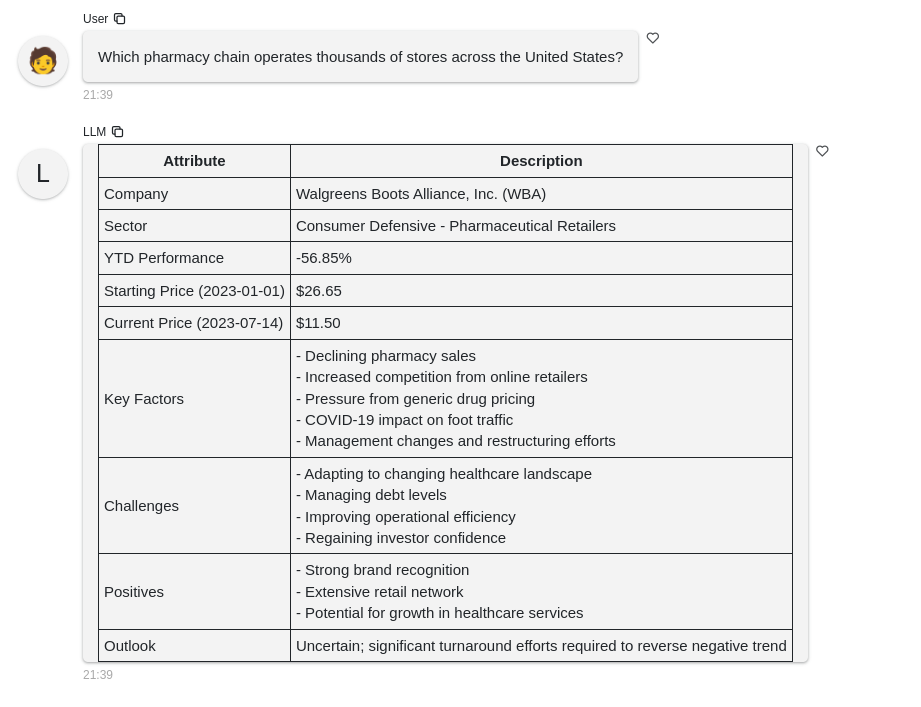

## 1. [Tool use in Claude (function calling)](https://docs.anthropic.com/en/docs/build-with-claude/tool-use)

#### ex: Stock Performance Analysis Tool

| Component | Function/Feature | Description |
|-----------|------------------|-------------|
| Ticker Symbol Lookup | `get_stock_ticker()` | Determines stock ticker from company description using Claude AI |
| Stock Data Retrieval | `get_stock_price()` | Fetches stock data using yfinance |
| Performance Calculation | `get_stock_performance()` | Calculates stock performance since the beginning of the year |
| AI-Powered Analysis | Claude AI integration | Generates performance analysis using Claude AI |
| User Interface | Panel-based chat interface | Presents results in a chat interface for user interaction |

 
 
 
