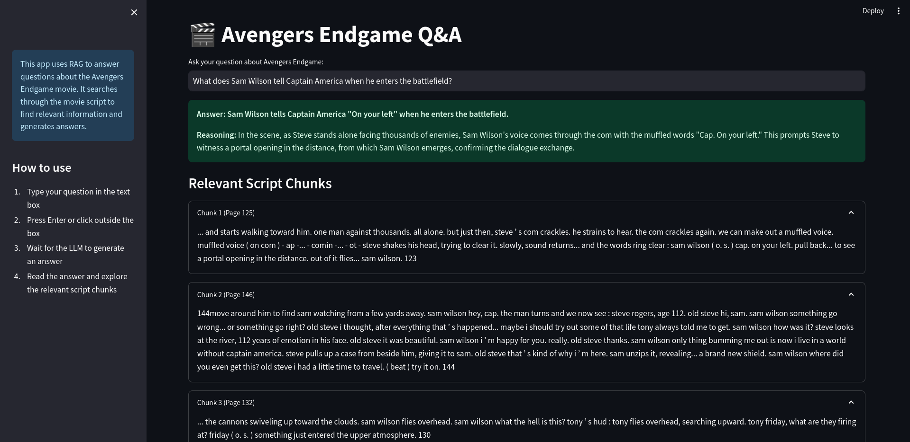

# Avengers Endgame Q&A chatbot

## Overview

This project creates a question-answering system for the movie "Avengers Endgame" using Retrieval-Augmented Generation (RAG). It consists of two main components:

1. A Jupyter notebook (`test.ipynb`) for data preparation and testing
2. A Streamlit web application (`app.py`) for user interaction

## Components

### Data Preparation (`test.ipynb`)

1. **PDF Processing**
   - Reads the Avengers Endgame script PDF from a URL
   - Extracts text from PDF pages

2. **Text Splitting**
   - Uses `SentenceTransformersTokenTextSplitter` to split text into chunks

3. **Vector Database**
   - Utilizes ChromaDB to store and retrieve text chunks
   - Creates a persistent collection named "endgame"

4. **Query Testing**
   - Demonstrates querying the vector database
   - Uses OpenAI's GPT model to generate answers

### Web Application (`app.py`)

- Built with Streamlit
- Provides a user interface for asking questions about Avengers Endgame
- Queries the ChromaDB collection
- Uses OpenAI's GPT model to generate answers
- Displays answers and relevant script chunks

## Key Libraries

- `chromadb`: Vector database for storing and querying text chunks
- `openai`: Interface for OpenAI's language models
- `streamlit`: Web application framework
- `langchain`: Used for text splitting
- `pypdf`: PDF processing

## Workflow

1. User inputs a question
2. Application queries ChromaDB for relevant text chunks
3. Relevant chunks are sent to OpenAI's GPT model along with the question
4. GPT generates an answer based on the provided context
5. Answer and relevant script chunks are displayed to the user

## Setup

- Requires setting up environment variables (OPENAI_API_KEY)
- ChromaDB persistent storage in "db" directory

## Usage

1. Run `test.ipynb` to prepare the data and populate the vector database
2. Launch the Streamlit app using `streamlit run app.py`
3. Input questions about Avengers Endgame in the web interface